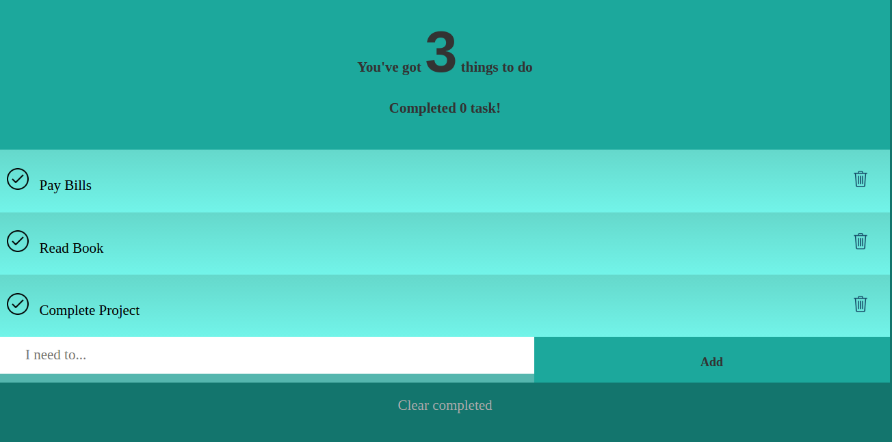

# Simple Vue Js Todo App
Vue js is an example of a simple todo app when I try to learn.

## Demo link
[Vue js todo app demo link](https://vue-js-todo-app.herokuapp.com/)

## Theme
[Codepen.io](https://codepen.io/Russbrown/pen/IgBuh)

#### Info
I created index.php to work in heroku

## Contributors
- [barisesen](https://github.com/barisesen) Barış Esen - creator, maintainer
- [barisesen.com](https://barisesen.com)
